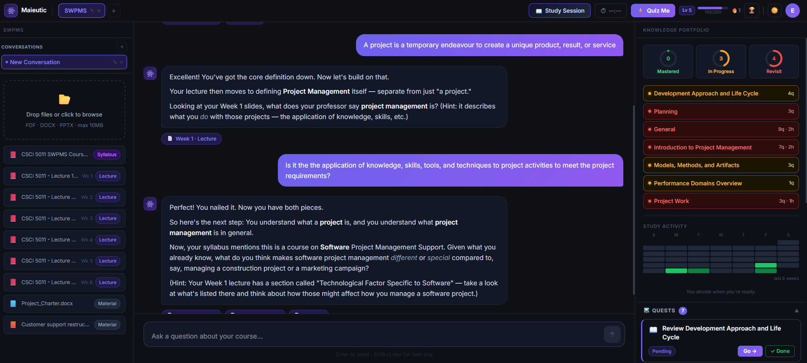
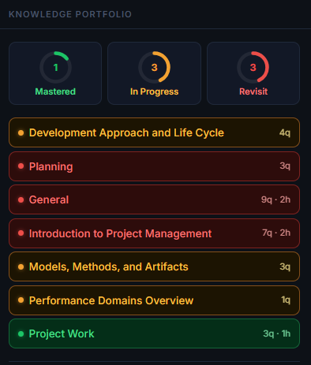
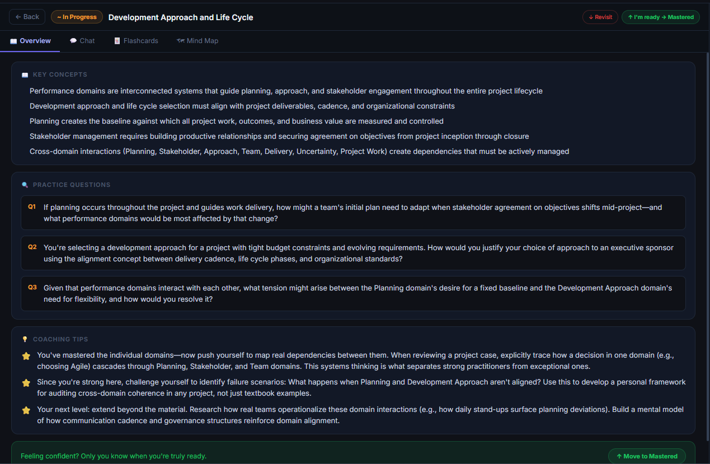
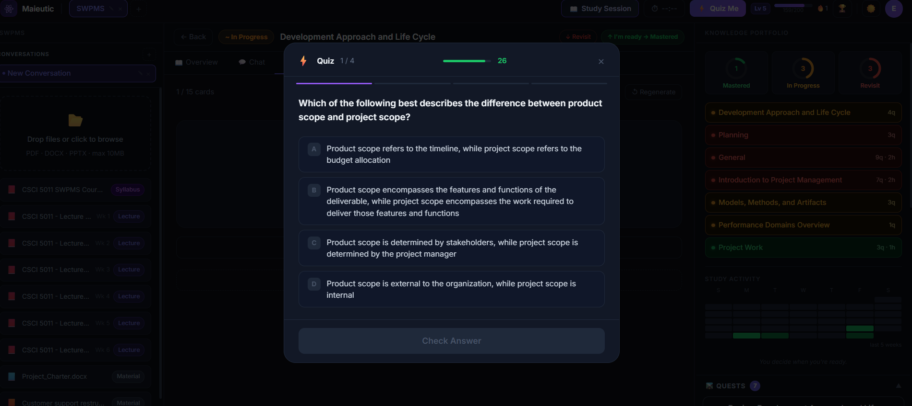

# Maieutic

> An AI tutor that knows your course, refuses to shortcut your thinking, and is available the moment you need it.

**[Live Demo](https://ai-professor-office-hours-simulator.vercel.app)**

---

## What This Is

Maieutic is an AI-native study tool built for a specific problem: at 11pm the night before an exam, no help exists that actually knows your course. Google is generic. ChatGPT has never read your professor's slides. Reddit gives you decontextualized answers. Office hours are tomorrow.

Upload your actual course materials — lecture slides, notes, syllabus, assignments — and ask questions. The AI answers exclusively from those materials, referencing the exact week and framing your professor used. Critically, it never gives you the direct answer. It uses the Socratic method — guiding questions, hints drawn from your own notes, sub-problems — until you arrive at the answer yourself.

The human always does the cognitive work. The AI just refuses to let them skip it.

---

## Screenshots

### Landing Page
*Animated page with scroll-reveal effects, gradient text, and direct sign-up routing.*

<p align="center">
  
</p>

### Socratic Chat in Action
*Three-column layout: file uploads on the left, Socratic AI chat in the center, and Knowledge Portfolio on the right. The AI guides students through questions using their own course materials — never giving the direct answer.*

<p align="center">
  
</p>

### Knowledge Portfolio
*Topics extracted from your syllabus, color-coded by mastery level. Green = mastered, yellow = in progress, red = needs revisiting. Tracks questions asked and hints needed across sessions.*

<p align="center">
  
</p>

### Topic Rooms
*Deep-dive into any topic with AI-generated key concepts, practice questions, and coaching tips. Includes interactive flashcards and a collapsible mind map visualization.*

<p align="center">
  
</p>

### Quiz Mode
*AI-generated multiple-choice quizzes with a timed countdown. Tests understanding, not memorization — questions are drawn from diverse chunks across weeks.*

<p align="center">
  
</p>

---

## Features

### Socratic Chat with Source Citations
Ask any question about your course materials. The AI guides you to the answer through follow-up questions and hints — never giving it away. Every response cites the exact source file and week number.

### Multi-Course Support
Create separate courses, each with their own uploaded materials, chat history, and progress tracking. Switch between them instantly via header tabs.

### Knowledge Portfolio & Weak Spot Tracking
Topics are automatically extracted from your syllabus and tracked across sessions. See at a glance which topics you've mastered, which need more work, and which to revisit — color-coded as green, yellow, or red.

### Topic Rooms
Dive deep into any topic with an AI-generated overview (key concepts, practice questions, coaching tips), interactive flashcards with 3D flip animation, and a collapsible mind map visualization.

### Gamification
- **XP & Levels** — earn XP for every chat message and quiz, with streak multipliers
- **Quiz Mode** — AI-generated multiple-choice quizzes with a 30-second timer per question
- **Achievements** — 10 badge types (Hot Streak, Sharpshooter, Night Owl, etc.)
- **Streak Calendar** — GitHub-style contribution grid tracking daily study activity

### Study Sessions
Start a structured study session with an AI-generated plan. The system tracks your time, suggests breaks, and generates a summary at the end with quest recommendations for next steps.

### Quests & Side Quests
AI-generated quests from session summaries guide your study priorities. Add your own side quests as a personal to-do list.

### Focus Timer
Built-in timer with presets (5/15/25/45/60 min) and a full-screen completion modal.

### Dark / Light Mode
Full theme support with 25+ color tokens. Your preference is saved to localStorage.

### Landing Page
Animated marketing page with scroll-reveal effects, feature highlights, and direct sign-up/sign-in routing.

---

## What Makes This Different from NotebookLM

NotebookLM is a retrieval tool. Its entire design goal is to surface the answer faster. This system's design goal is the opposite — to create productive friction. The Socratic constraint is not a feature layered on top of retrieval. It is a complete inversion of retrieval's value proposition.

Additionally, NotebookLM has no memory of struggle. Every session starts fresh. This system tracks, across sessions, which topics the student asked about, how many hints they needed, and whether they resolved their confusion. That longitudinal weak spot map is a fundamentally different product theory.

---

## The Human Decision — Where AI Must Stop

The AI never certifies that the student is ready for the exam. It can confirm whether a specific answer is correct. It can surface your weak spot map. But it cannot tell you "you're prepared." Readiness depends on factors the AI cannot fully observe: test anxiety, sleep, time pressure, the specific question framing the professor will use. An AI that declares readiness creates false confidence. At the end of every session, instead of a readiness score, the system surfaces three things: what the student demonstrated understanding of tonight, what they haven't tested themselves on yet, and what to prioritize in remaining time. The decision of when to stop studying is always the student's.

---

## Tech Stack

| Layer | Choice |
|---|---|
| Frontend | React + Vite |
| Styling | Tailwind CSS v4 + inline theme tokens |
| Backend | Node.js + Express v5 |
| AI — Chat | Claude API (`claude-haiku-4-5-20251001`) |
| AI — Embeddings | `@xenova/transformers` (`all-MiniLM-L6-v2`, 384-dim, runs locally) |
| Vector Database | Supabase + pgvector (HNSW index) |
| Auth | Supabase Auth (email/password) |
| File Parsing | pdf-parse, mammoth, adm-zip (PPTX) |
| Frontend Hosting | Vercel |
| Backend Hosting | Railway |

---

## Project Structure

```
maieutic/
  client/                          # React + Vite frontend
    src/
      components/
        LandingPage.jsx            # Marketing landing page
        AuthGate.jsx               # Login / signup gate
        ChatPanel.jsx              # Chat UI with Socratic AI
        FileUpload.jsx             # Drag-and-drop file upload
        FileViewerModal.jsx        # Slide-in file viewer panel
        KnowledgePortfolio.jsx     # Topic tracking dashboard
        TopicRoom.jsx              # Deep-dive: overview, flashcards, mind map
        QuizMode.jsx               # Timed multiple-choice quizzes
        StudySessionModal.jsx      # Study session wizard
        ActiveSessionBanner.jsx    # Session timer banner
        SessionSummaryPanel.jsx    # AI-generated session summary
        QuestPanel.jsx             # AI quest sidebar
        SideQuestPanel.jsx         # User to-do list
        FocusTimer.jsx             # Pomodoro-style timer
        CourseTabs.jsx             # Multi-course header tabs
        XpBar.jsx                  # Level + XP progress bar
        Achievements.jsx           # Badge grid modal
        StreakCalendar.jsx         # GitHub-style study calendar
      hooks/
        useAuth.js                 # Supabase auth state
        useChat.js                 # Chat with conversation persistence
        useUpload.js               # File upload state
        useQuests.js               # Quest CRUD
      context/
        ThemeContext.jsx            # Dark/light theme provider
      lib/
        supabase.js                # Supabase client
  server/                          # Node.js + Express backend
    src/
      routes/
        upload.js                  # POST /api/upload
        chat.js                    # POST /api/chat
        courses.js                 # GET/POST/DELETE /api/courses
        files.js                   # GET /api/files/:courseId/*
        topics.js                  # GET /api/topics/:courseId
        session.js                 # GET /api/session/:id/summary
        quiz.js                    # POST /api/quiz/generate, /check
        xp.js                      # GET /api/xp
        achievements.js            # GET /api/achievements
        studySessions.js           # Study session CRUD
        quests.js                  # Quest CRUD
        sideQuests.js              # Side quest CRUD
        conversations.js           # Conversation persistence
        topicRoom.js               # Topic room + flashcard generation
      lib/
        parser.js                  # PDF/DOCX/PPTX text extraction
        chunker.js                 # ~500 token chunking with overlap
        embeddings.js              # Local embedding via @xenova/transformers
        retrieval.js               # Vector similarity search
        claude.js                  # Socratic response generation
        topicExtractor.js          # Syllabus topic extraction
      db/
        supabase.js                # Supabase client (anon key)
        supabaseWithAuth.js        # RLS-scoped client factory
      index.js                     # Express app entry point
```

---

## Local Setup

```bash
# Clone the repo
git clone https://github.com/semani01/ai-professor-office-hours-simulator.git
cd ai-professor-office-hours-simulator

# Install server dependencies
cd server && npm install

# Install client dependencies
cd ../client && npm install
```

### Environment Variables

**Server** — create `server/.env`:
```
CLAUDE_API_KEY=your_anthropic_api_key
SUPABASE_URL=your_supabase_project_url
SUPABASE_ANON_KEY=your_supabase_anon_key
PORT=3001
FRONTEND_URL=http://localhost:5173
```

**Client** — create `client/.env`:
```
VITE_SUPABASE_URL=your_supabase_project_url
VITE_SUPABASE_ANON_KEY=your_supabase_anon_key
VITE_API_URL=
```

> Leave `VITE_API_URL` empty for local development (Vite proxy handles it). Set it to the Railway URL in production.

### Run

```bash
# Terminal 1 — start the backend (from /server)
npm run dev

# Terminal 2 — start the frontend (from /client)
npm run dev
```

Frontend: `http://localhost:5173` | Backend: `http://localhost:3001`

---

## Documentation

| File | Contents |
|---|---|
| `ARCHITECTURE.md` | System design, data flow, Supabase schema |
| `ROADMAP.md` | Phase-by-phase build plan |
| `PROMPTS.md` | Claude system prompt with rationale |
| `IMPLEMENTATION.md` | Running build log — decisions and problems |
| `TASKS.md` | Build tracker with exit conditions per phase |
